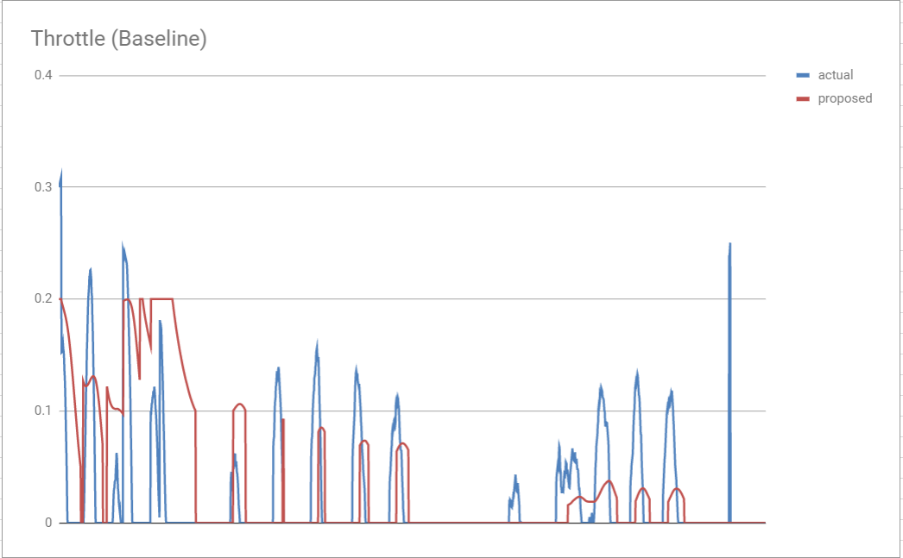
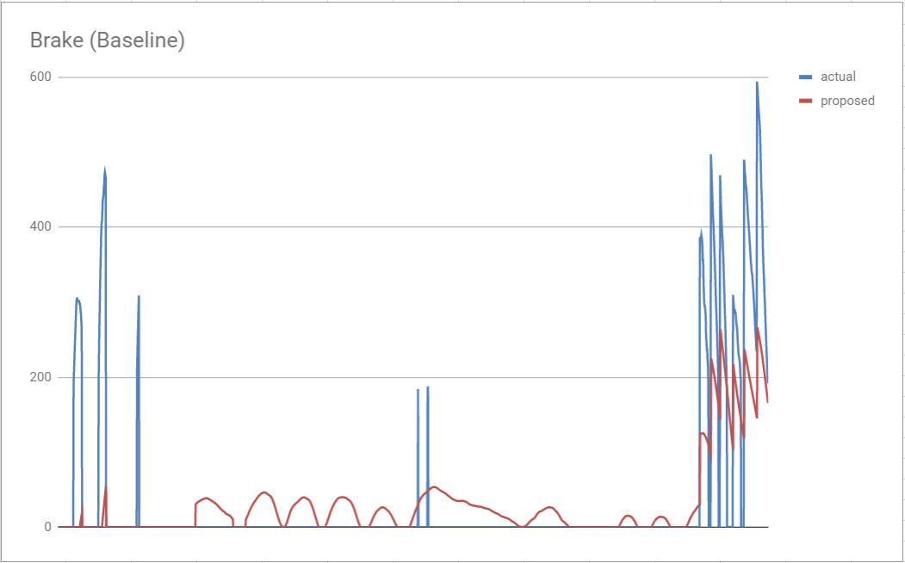
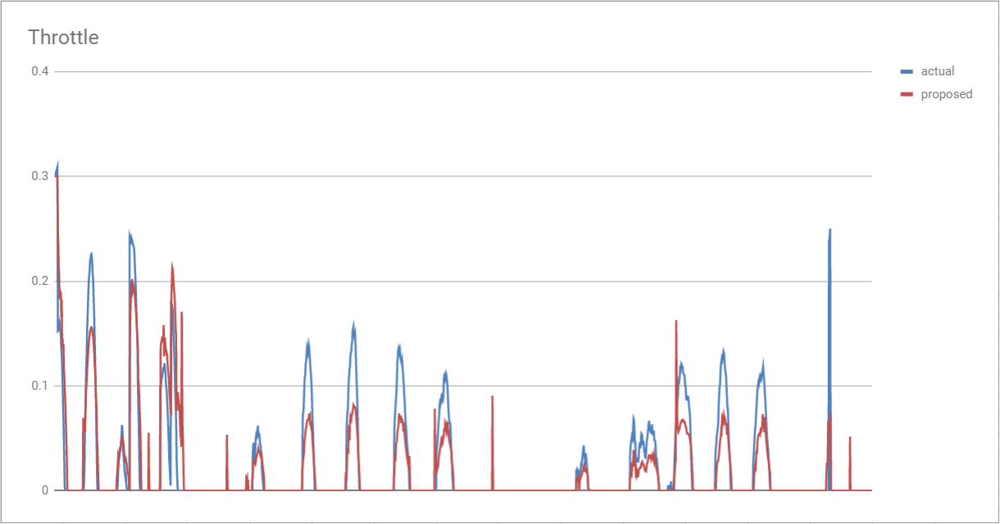
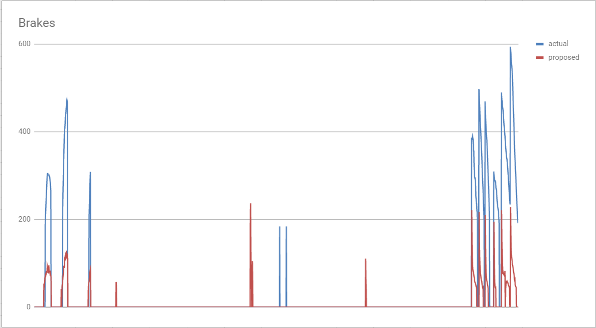
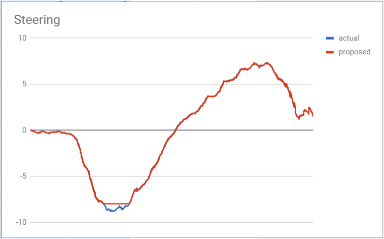
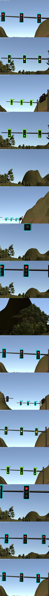
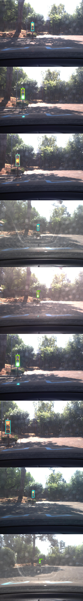

# Self-Driving Car Nanodegree Capstone Project: Team Blindspot
Submission for Udacity Self-Driving Car Nanodegree Capstone Project Programming a Real Self-Driving Car.

| Team Member      | Email                            |
| ---------------- | ---------------------------------|
| Dario Cazzani    | dariocazzani@gmail.com           |
| Mohamed Abutaleb | abutaleb_1984@yahoo.com          |
| Vivek Chand      | vivekchand19@gmail.com           |
| Jorge Septien    | jseptienr@hotmail.com            |
| Lybron Sobers    | |

## Project Overview
The goal for this project was to implement a ROS-based Autonomous Vehicle System that includes traffic light detection, control, and waypoint following. The system should be able to operate in the simulation environment provided by Udacity and later tested on Udacity real autonomous vehicle Carla. The project encompasses several topics learned throughout the Self-Driving Carn Engineer program that are applied to a complete autonomous vehicle system.

The project involved the implementation of the different nodes containing specific functionality related to autonomous driving. Our implementation built upon the baseline provided by the project walkthroughs and modified to improve performance making the system more robust for a real life scenario. The main architecture of the system and a description of the components is presented in the following sections.

A sample run of the system running in the simulator can be found [here](https://drive.google.com/file/d/186Qs9Uk03ucFTH3vmUkhLka1RdgKyy5q/view?usp=sharing).


## System Architecture


### Waypoint Loader Node
This package loads waypoints from static data and publishes the base waypoints for the `waypoint_updater` node to use. No modifications were made to this module.

### Waypoint Follower Node
This package contains from Autoware and subscribes to `/final_waypoints` topic in order to publish the desired target velocities as `twists_cmd` to be used by the `dbw_node` for actuation of vehicle controls. This package was only modified to update commands always removing the logic for only updating when the vehicle is not following the waypoints. This reduces some of the oscilation of the vehicle and produces a more stable result.

### Waypoint Updater Node
The Waypoint Updater Node is in charge of publishing a list of waypoints for the vehicle to follow with appropriate pose and velocity data. The implementation is found in `waypoint_updater` and uses the published base waypoint list as it's baseline for trajectory planning. Once the base waypoints are received, the node publishes a lane by splicing the base waypoints from the closest waypoint to a defined number of waypoints ahead. The frequency for this node was set to 10 Hz to avoid overusing resources that were seen to cause problems when running on the simulator.

The lane generated depends on the occurrence of a stopline being published by the tl_detector signaling the vehicle approaching a red light allowing it to set a deceleration path for the vehicle to stop at the light. If there is no stopline index (value of -1) the lane generated will only contain base waypoints and maintain its state following the default velocity data. Otherwise, we need to calculate the deceleration path for the vehicle to stop using the distance to the stopline. This lane will be published for the `waypoint_follower` node to set target velocities.

### DBW Node
The Drive by Wire (DBW) Node main function is to publish the appropriate throttle, brake, and steering commands based on the current state of the vehicle. It uses data received from `/twist_cmd` topic from the waypoint follower node. The vehicle control data are published through the following topics:

* `vehicle/throttle_cmd`
* `vehicle/brake_cmd`
* `vehicle/steering_cmd`

The module detects when a driver is controlling the vehicle by subscribing to the `/vehicle/dbw_enabled` topic and disabling the controllers to avoid unexpected behavior.

The `dbw_node` uses a helper class names `twist_controller` to perform control operations. In this class, a PID controller is used to generate the appropriate throttle and brake response based on the error resulting from the desired velocity and the current velocity of the vehicle. Control commands are published at a frequency of 50 Hz which is expected by Carla.

A single PID controller is used for both operation and the algorithm includes a dead-band region two avoid engaging the throttle when braking and vice versa. When the response value crosses this region the appropriate control value is set and published.

A low pass filter is used to reduce high frequency changes in the controls to produce a smoother response. Throttle is maxed at 0.3 to avoid full engagement and brakes have an acceleration limit of to prevent loosing traction in a forceful stop. Brake commands are in units of `N*m`.

The PID loop was tuned using the `dbw_test` script that compares the response of the `dbw_node` against a successful implementation using data from a `ROS bag`. Through several iterations the selected `Kp`, `Ki`, and `Kd` parameters resulted in the best performance as compared to the baseline implementation.

Steering is controlled using the provided `yaw_controller` implementation as it produced a good response and changes to this implementation resulted in marginal improvements.

The results from testing are shown below compared to the baseline implementation from the project walkthrough.

#### Baseline Results





#### Final Results







### Traffic Light Detection Node
Traffic Light Detection is a crucial part in perception module in self-driving car to make the vehicle able to recognize the traffic light's status to take the right action either to stop or continue driving. The on-board vehicle's camera provides this node the image frames to this node and publish the traffic light's status to `/traffic_waypoint` topic. According to this information the waypoint updater node determines the vehicle's action either to stop, slow down or continue driving.

Our solution is implementation of deep learning model for the simulator and test site. We used Tensorflow Object Detection API to detect the traffic light status. We experimented two models `ssd_inception_v2_coc` and `faster_rcnn_inception_v2_coco` for this part. We decided to use for simulator and Carla submissions the `ssd_inception_v2_coc` due to it's performance in detection and processing time. This model is a pre-trained model on COCO dataset for 90 different classes. The traffic light is included in the COCO dataset but it just localize the traffic light and doesn't detect its status. Therefore, we re-trained the model on Simulator and site data to make single shot detection. We extracted the train data from the simulator and ROSbag file and modified the model `ssd_inception_v2_coco-sim.config` and `ssd_inception_v2_coco-real.config` file to be suited to our needs. More information about setup and training can be found in  [Traffic Light Detector](https://github.com/Eng-Mo/Traffic-Light-Classifier.git) and the following is the result:       





## Project Information (From Original Repo)
This is the project repo for the final project of the Udacity Self-Driving Car Nanodegree: Programming a Real Self-Driving Car. For more information about the project, see the project introduction [here](https://classroom.udacity.com/nanodegrees/nd013/parts/6047fe34-d93c-4f50-8336-b70ef10cb4b2/modules/e1a23b06-329a-4684-a717-ad476f0d8dff/lessons/462c933d-9f24-42d3-8bdc-a08a5fc866e4/concepts/5ab4b122-83e6-436d-850f-9f4d26627fd9).

Please use **one** of the two installation options, either native **or** docker installation.

### Native Installation

* Be sure that your workstation is running Ubuntu 16.04 Xenial Xerus or Ubuntu 14.04 Trusty Tahir. [Ubuntu downloads can be found here](https://www.ubuntu.com/download/desktop).
* If using a Virtual Machine to install Ubuntu, use the following configuration as minimum:
  * 2 CPU
  * 2 GB system memory
  * 25 GB of free hard drive space

  The Udacity provided virtual machine has ROS and Dataspeed DBW already installed, so you can skip the next two steps if you are using this.

* Follow these instructions to install ROS
  * [ROS Kinetic](http://wiki.ros.org/kinetic/Installation/Ubuntu) if you have Ubuntu 16.04.
  * [ROS Indigo](http://wiki.ros.org/indigo/Installation/Ubuntu) if you have Ubuntu 14.04.
* [Dataspeed DBW](https://bitbucket.org/DataspeedInc/dbw_mkz_ros)
  * Use this option to install the SDK on a workstation that already has ROS installed: [One Line SDK Install (binary)](https://bitbucket.org/DataspeedInc/dbw_mkz_ros/src/81e63fcc335d7b64139d7482017d6a97b405e250/ROS_SETUP.md?fileviewer=file-view-default)
* Download the [Udacity Simulator](https://github.com/udacity/CarND-Capstone/releases).

### Docker Installation
[Install Docker](https://docs.docker.com/engine/installation/)

Build the docker container
```bash
docker build . -t capstone
```

Run the docker file
```bash
docker run -p 4567:4567 -v $PWD:/capstone -v /tmp/log:/root/.ros/ --rm -it capstone
```

### Port Forwarding
To set up port forwarding, please refer to the [instructions from term 2](https://classroom.udacity.com/nanodegrees/nd013/parts/40f38239-66b6-46ec-ae68-03afd8a601c8/modules/0949fca6-b379-42af-a919-ee50aa304e6a/lessons/f758c44c-5e40-4e01-93b5-1a82aa4e044f/concepts/16cf4a78-4fc7-49e1-8621-3450ca938b77)

### Usage

1. Clone the project repository
```bash
git clone https://github.com/udacity/CarND-Capstone.git
```

2. Install python dependencies
```bash
cd CarND-Capstone
pip install -r requirements.txt
```
3. Make and run styx
```bash
cd ros
catkin_make
source devel/setup.sh
roslaunch launch/styx.launch
```
4. Run the simulator

### Real world testing
1. Download [training bag](https://s3-us-west-1.amazonaws.com/udacity-selfdrivingcar/traffic_light_bag_file.zip) that was recorded on the Udacity self-driving car.
2. Unzip the file
```bash
unzip traffic_light_bag_file.zip
```
3. Play the bag file
```bash
rosbag play -l traffic_light_bag_file/traffic_light_training.bag
```
4. Launch your project in site mode
```bash
cd CarND-Capstone/ros
roslaunch launch/site.launch
```
5. Confirm that traffic light detection works on real life images
